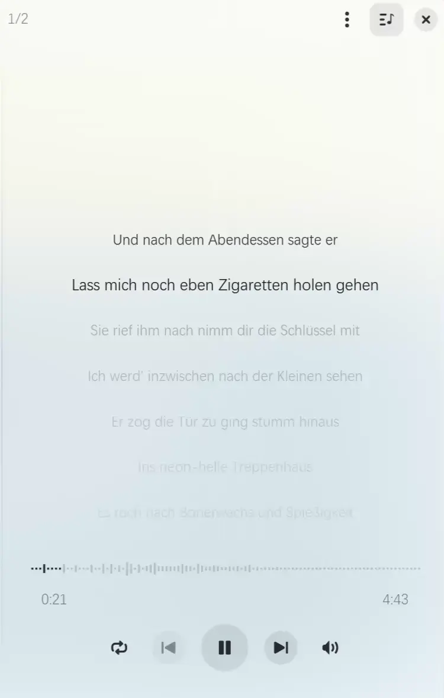

# Gapless Vibe
A fork of Gapless, supporting lyric and playtime spectrum through vibe coding.



Installed beside the original Gapless, as `com.github.neithern.g4music.vibe`
(binary `g4music-vibe`), with its own settings and MPRIS name.

## Build and install

Needs `flatpak` (1.4+) and `flatpak-builder`, plus the GNOME 50 runtime:

```sh
flatpak install --user flathub org.gnome.Platform//50 org.gnome.Sdk//50
```

Build the app together with its gxml dependency and install it for the
current user, from the project root:

```sh
flatpak-builder --user --install --force-clean .flatpak-builder/vibe \
    pkgs/flatpak/com.github.neithern.g4music.vibe.json
```

Then start it from the app grid, or with:

```sh
flatpak run com.github.neithern.g4music.vibe
```

The sandbox only reads `~/Music`. To play a collection elsewhere, either move
it there or grant one more path:

```sh
flatpak override --user --filesystem=/path/to/music com.github.neithern.g4music.vibe
```

Lyrics are read from the track tags (LRC or TTML text) or from a `.lrc` /
`.ttml` file next to the track having the same name.


Below is the original README.


# Gapless
Play your music elegantly.


Gapless (AKA: G4Music) is a light weight music player written in GTK4, focuses on large music collection.

## Features
- Supports most music file types, Samba and any other remote protocols (depends on GIO and GStreamer).
- Fast loading and parsing thousands of music files in very few seconds, monitor local changes.
- Low memory usage for large music collection with album covers (embedded and external), no thumbnail caches to store.
- Group and sorts by album/artist/title, shuffle list, full-text searching.
- Fluent adaptive user interface for different screen (Desktop, Tablet, Mobile).
- Gaussian blurred cover as background, follows GNOME light/dark mode.
- Supports creating and editing playlists, drag cover to change order or add to another playlist.
- Supports drag and drop with other apps.
- Supports audio peaks visualizer.
- Supports gapless playback.
- Supports normalizing volume with ReplayGain.
- Supports specified audio sink.
- Supports MPRIS control.
